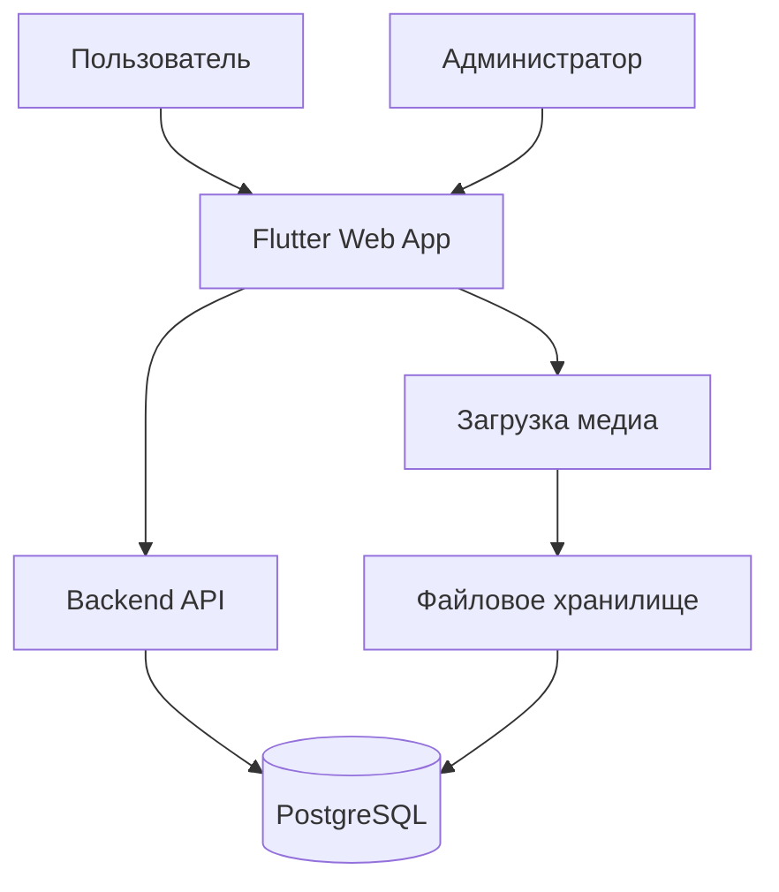

# Архитектура Flutter + Dart Backend приложения

## Общая структура проекта

```
flutter_project/
├── frontend/                    # Flutter приложение
│   ├── lib/
│   │   ├── main.dart
│   │   ├── models/
│   │   │   ├── media_model.dart
│   │   │   └── user_model.dart
│   │   ├── services/
│   │   │   ├── api_service.dart
│   │   │   └── auth_service.dart
│   │   ├── pages/
│   │   │   ├── home_page.dart
│   │   │   ├── admin_page.dart
│   │   │   └── login_page.dart
│   │   ├── widgets/
│   │   │   ├── media_grid.dart
│   │   │   ├── media_card.dart
│   │   │   ├── media_modal.dart
│   │   │   └── download_button.dart
│   │   ├── utils/
│   │   │   ├── constants.dart
│   │   │   └── helpers.dart
│   │   └── theme/
│   │       └── app_theme.dart
│   ├── assets/
│   │   ├── images/
│   │   └── videos/
│   ├── web/                    # Web-specific files
│   └── pubspec.yaml
├── backend/                    # Dart shelf сервер
│   ├── lib/
│   │   ├── main.dart
│   │   ├── database/
│   │   │   ├── connection.dart
│   │   │   └── migrations/
│   │   ├── models/
│   │   │   ├── media.dart
│   │   │   └── user.dart
│   │   ├── routes/
│   │   │   ├── media_routes.dart
│   │   │   └── auth_routes.dart
│   │   ├── middleware/
│   │   │   └── auth_middleware.dart
│   │   └── utils/
│   │       └── config.dart
│   ├── bin/
│   │   └── server.dart
│   ├── pubspec.yaml
│   └── Dockerfile
├── database/                   # Скрипты PostgreSQL
│   ├── init.sql
│   └── seed.sql
├── docs/                       # Документация
├── scripts/                    # Вспомогательные скрипты
├── .gitignore
├── README.md
└── architecture.md
```

## Компоненты системы

### Frontend (Flutter)
- **main.dart** - точка входа
- **pages** - экраны приложения (главная, админка, логин)
- **widgets** - переиспользуемые компоненты (карточки медиа, модальное окно, кнопка скачивания)
- **services** - взаимодействие с бэкендом (API, аутентификация)
- **models** - модели данных
- **theme** - тема с заданными цветами

### Backend (Dart shelf)
- **server.dart** - запуск сервера
- **routes** - обработка HTTP запросов (GET /media, POST /upload, etc.)
- **database** - подключение к PostgreSQL и миграции
- **models** - ORM/сущности базы данных
- **middleware** - middleware для аутентификации

### База данных (PostgreSQL)
- Таблица `media` (id, type, url, thumbnail, created_at)
- Таблица `users` (id, username, password_hash, role)

## Цветовая палитра
Используемые цвета:
- Primary: `#6b28c9` (фиолетовый)
- Secondary: `#d91136` (красный)
- Accent: `#cc7212` (оранжевый)
- Success: `#3d9e33` (зеленый)
- Info: `#4191b0` (синий)

## Взаимодействие компонентов



## Требования к функционалу

1. **Главная страница**
   - Сетка медиа (фото, видео, гиф)
   - Фильтрация по типу
   - Hover эффект с увеличением и фиолетовой рамкой
   - Клик открывает модальное окно (80% экрана)

2. **Модальное окно**
   - Отображение медиа в полном размере
   - Кнопка скачивания (центр снизу)
   - Для видео: элементы управления (пауза, воспроизведение)

3. **Админка**
   - Авторизация (логин/пароль)
   - Форма загрузки новых медиа (фото, видео, гиф)
   - Просмотр существующих медиа

4. **Бэкенд API**
   - GET /api/media - список медиа
   - POST /api/media - загрузка
   - GET /api/media/{id}/download - скачивание
   - POST /api/auth/login - авторизация

## Следующие шаги
1. Создать структуру папок
2. Инициализировать Flutter проект
3. Настроить бэкенд
4. Реализовать базовые экраны