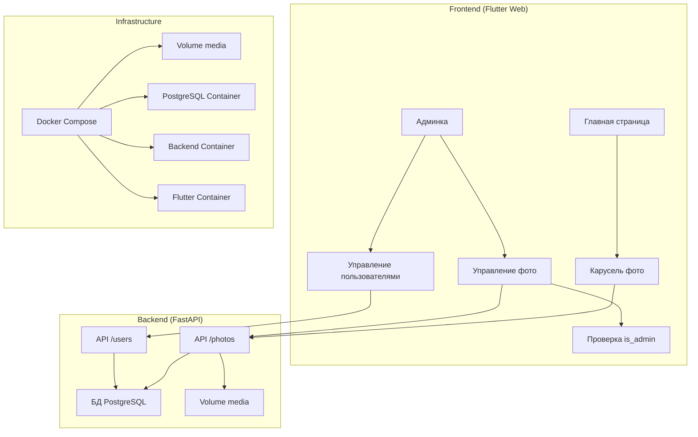

# Техническое задание: Добавление функционала фотогалереи и управления фото

## 1. Общее описание
Требуется расширить существующее Flutter веб-приложение с бэкендом на FastAPI и БД PostgreSQL, добавив:
- Блок прокрутки фото на главной странице (карусель)
- Раздел управления фото в админке (добавление/удаление)
- Разделение прав доступа: только пользователи с флагом IsAdmin могут управлять фото
- Хранение фото в Docker volume `media` (уже существует)

## 2. Требования к функционалу

### 2.1 Главная страница
- Блок размером 250x250 пикселей для отображения фото.
- Каждое фото отображается внутри квадрата 250x250 с сохранением пропорций; пустые поля заливаются нейтральным фоном (например, серым).
- Если в базе нет фото, отображается текст "Нет фото в базе".
- Если фото 3 или меньше — отображаются статично (без прокрутки).
- Если фото больше 3 — автоматическая циклическая прокрутка (карусель) с интервалом 5 секунд.
- Прокрутка должна быть плавной, с индикаторами текущего фото (точки или цифры).
- Поддержка ручного переключения (свайп/клик по стрелкам).

### 2.2 Админка
#### 2.2.1 Управление фото
- Отдельный раздел "Управление фото" внутри админки (после входа).
- Только пользователи с флагом IsAdmin = 1 имеют доступ к этому разделу.
- Если пользователь не админ, отображается заглушка: "Ваши права в доработке!".
- В разделе отображается список загруженных фото (превью, имя файла, дата загрузки).
- Кнопка "Добавить фото" открывает диалог выбора файла.
- Ограничения на загрузку:
  - Максимальный размер файла: 5 МБ.
  - Допустимые форматы: JPG, PNG, GIF.
- После загрузки фото автоматически сохраняется в volume `media` и запись добавляется в БД.
- Для каждого фото есть кнопка "Удалить", которая удаляет файл из volume и запись из БД.

#### 2.2.2 Управление пользователями (существующий функционал)
- Оставить текущий раздел управления пользователями.
- Добавить в таблицу users поле `is_admin` (boolean, по умолчанию false).
- В интерфейсе админки при добавлении/редактировании пользователя добавить чекбокс "Администратор".
- Только администраторы могут добавлять/удалять других пользователей (опционально, но по ТЗ не требуется, оставляем как есть).

### 2.3 Бэкенд (API)
#### 2.3.1 Модель БД
- Создать таблицу `photos` со следующими полями:
  - `id` (serial primary key)
  - `filename` (varchar) — имя файла в volume
  - `filepath` (varchar) — относительный путь внутри volume
  - `uploaded_at` (timestamp) — дата загрузки
  - `size` (integer) — размер файла в байтах
  - `mime_type` (varchar) — тип файла
- Добавить в таблицу `users` поле `is_admin` (boolean, default false).

#### 2.3.2 Эндпоинты
- `GET /photos` — возвращает список всех фото (JSON с метаданными).
- `GET /photos/{id}` — возвращает метаданные конкретного фото.
- `GET /photos/{id}/file` — отдаёт файл фото (статический доступ через volume).
- `POST /photos` — загрузка нового фото (multipart/form-data).
- `DELETE /photos/{id}` — удаление фото.
- `PATCH /users/{id}` — обновление поля is_admin (для админки).

#### 2.3.3 Авторизация и права
- Эндпоинты POST/DELETE /photos требуют авторизации и проверки is_admin.
- Эндпоинты GET /photos публичные (для главной страницы).

### 2.4 Docker и инфраструктура
- Volume `media` уже существует, нужно подключить его к контейнеру backend (или отдельному сервису) по пути `/app/media`.
- В docker-compose.yml добавить volume `media` и смонтировать в сервисе backend.
- Обеспечить правильные права на запись в volume.

### 2.5 Фронтенд (Flutter)
#### 2.5.1 Главная страница (HomePage)
- Переработать `lib/pages/home_page.dart`:
  - Добавить виджет карусели (использовать пакет carousel_slider или аналогичный).
  - Загружать список фото через API GET /photos.
  - Обрабатывать состояния: загрузка, нет фото, ошибка.
  - Реализовать адаптивное отображение (3 и меньше фото — без автопрокрутки).

#### 2.5.2 Админка (AdminPage)
- Расширить `lib/pages/admin_page.dart`:
  - Добавить табы или разделы: "Пользователи" и "Фото".
  - В разделе "Фото" отображать список загруженных фото и форму загрузки.
  - Проверять is_admin текущего пользователя (через поле в ответе API /auth/login).
  - Если не админ, показывать заглушку.

#### 2.5.3 Сервисы
- Создать `lib/services/photo_service.dart` для работы с API фото.
- Обновить `lib/services/auth_service.dart` и `lib/services/database_service.dart` для поддержки is_admin.

### 2.6 Требования к стилю (UI/UX)
- Новый блок (карусель фото) должен соответствовать общему стилю сайта:
  - Цветовая палитра: использовать основные цвета из темы приложения (primaryColor: `#2E8B57`, accentColor: `#3CB371`, scaffoldBackgroundColor: `#F0F8F0`).
  - Шрифты: использовать те же, что и в остальном приложении (по умолчанию Flutter's Roboto).
  - Закругления углов: радиус 8 пикселей для контейнера фото.
  - Тени: легкая тень (elevation 2) для контейнера, чтобы выделить блок.
  - Индикаторы карусели: точки внизу, цвет активной точки — primaryColor, неактивной — серый.
  - Стрелки навигации (если используются) — стилизовать под дизайн сайта (иконки из Material Icons).
- Блок должен быть центрирован на странице, с отступами сверху/снизу.
- При отсутствии фото текст "Нет фото в базе" должен быть стилизован как заголовок среднего размера с серым цветом.
- В админке раздел управления фото должен использовать те же карточки (Card), что и раздел пользователей, для сохранения консистентности.
- Кнопки "Добавить фото" и "Удалить" должны использовать цвета темы (primaryColor для основных действий, red для удаления).
- Адаптивность: блок должен корректно отображаться на мобильных устройствах и планшетах (максимальная ширина 250px, но на больших экранах можно увеличить до 300px с сохранением пропорций).

## 3. Нефункциональные требования
- Производительность: загрузка фото не должна блокировать интерфейс.
- Безопасность: проверка MIME-типа, ограничение размера, защита от переполнения.
- Масштабируемость: volume media можно заменить на S3-совместимое хранилище в будущем.
- Логирование: логировать операции загрузки/удаления фото.

## 4. Этапы реализации
1. **Бэкенд:**
   - Добавить поле is_admin в таблицу users (миграция).
   - Создать таблицу photos.
   - Реализовать эндпоинты для работы с фото.
   - Настроить volume media в docker-compose.

2. **Фронтенд:**
   - Обновить HomePage для отображения карусели.
   - Создать раздел управления фото в AdminPage.
   - Добавить проверку прав is_admin.

3. **Интеграция и тестирование:**
   - Проверить загрузку фото через админку.
   - Проверить отображение на главной странице.
   - Проверить работу карусели (автопрокрутка, ручное управление).
   - Проверить права доступа (админ vs не админ).

4. **Деплой:**
   - Остановить контейнеры (`docker-compose down --rmi all`).
   - Пересобрать и запустить (`docker-compose up --build -d`).

## 5. Диаграмма архитектуры (Mermaid)

## 6. Примечания
- Volume `media` должен быть создан заранее (по утверждению пользователя, он уже есть).
- При удалении контейнеров данные в volume сохраняются.
- Для разработки можно использовать сиды: создать несколько тестовых фото и пользователя-администратора.

---
*ТЗ составлено на основе анализа проекта и уточнений от пользователя. После утверждения можно приступать к реализации.*